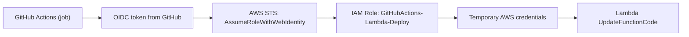
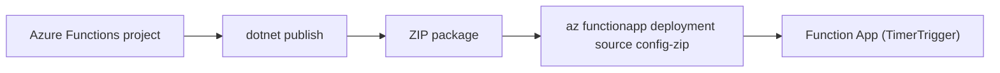

<div align="center">
  
  <h1>JobScraper</h1>
  <p>A C# job scraper with cloud-friendly deployment paths</p>
	
 	
  	
</div>

# 🚀 Overview

JobScraper automates fetching job postings from specific online sources (currently scoped to Innovasjon Norge via Webcruiter), stores new postings in Supabase PostgreSQL, and notifies via Twilio. The core logic is designed to run locally, on AWS Lambda, or on Azure Functions.

**Please note: This project is currently under active development, and more exciting features are planned!**

## ✨ Features

- Targeted web scraping from supported endpoints
- Structured parsing of job data into strong types
- Change detection and notification delivery via Twilio
- Daily scheduling on AWS Lambda or Azure Functions

# 🛠️ Tech Stack


# 📦 Getting Started (local)

### Prerequisites

- .NET SDK 10.0 or higher installed

### Installation

1. Clone the repository:

```bash
git clone https://github.com/YourGitHubUsername/JobScraper.git
cd JobScraper
```

2. Restore NuGet packages:
```bash
dotnet restore
```

This will install the required dependencies.

### Running the Application

To run the scraper locally:

```bash
dotnet run
```
Upon execution, the application will:

1. Connect to Supabase PostgreSQL
2. Fetch job data from the configured web endpoint
3. Insert any new jobs into the Jobs table

# 🧱 Repo Structure

Core projects:
- `/Users/adrianhammer/AA/projects/desktop/JobScraper/JobScraper` (core logic)
- `/Users/adrianhammer/AA/projects/desktop/JobScraper/JobScraper.Functions` (Azure Functions wrapper)

Deployment docs:
- `/Users/adrianhammer/AA/projects/desktop/JobScraper/LAMBDA_DEPLOY.md`
- `/Users/adrianhammer/AA/projects/desktop/JobScraper/LAMBDA_CICD.md`

# ☁️ AWS Lambda Deploy (OIDC)

GitHub Actions uses OIDC to deploy a zip package to AWS Lambda:



# ☁️ Azure Functions Deploy (ZIP)

Azure Functions uses a timer trigger and ZIP deployment:



See `/Users/adrianhammer/AA/projects/desktop/JobScraper/LAMBDA_DEPLOY.md` for AWS deployment steps and `/Users/adrianhammer/AA/projects/desktop/JobScraper/LAMBDA_CICD.md` for CI/CD options.

# 📄 License

Distributed under the MIT License. See ```LICENSE``` for more information.
