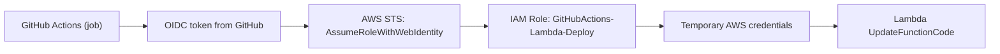

<div align="center">
  
  <h1>JobScraper</h1>
  <p>A C# web scraper for job postings</p>
	
 	
  	
</div>

# 🚀 Overview 

JobScraper is a C# application that automates fetching job postings from specific online sources *(currently scoped to Innovasjon Norge via Webcruiter)*. It deserializes JSON data, extracts key job details, and stores them in a Supabase-hosted PostgreSQL database.

**Please note: This project is currently under active development, and more exciting features are planned!**

## ✨ Features

- Targeted Web Scraping: Fetches job posting data from specified API endpoints.
- JSON Deserialization: Converts raw JSON responses into structured C# objects (JobResponseModels.Datum).
- Data Persistence: Stores job details in a Supabase-hosted PostgreSQL database.
- Foundational Data Handling: Establishes the core for future capabilities:
	- Detecting new job postings.
	- Identifying updates to existing job postings.
	- Tracking job application deadlines.
- Runs on a schedule (currently daily) to check for new postings.


# 🛠️ Technologies Used
[](https://bentos.jkominovic.dev/api/v1/generic-card?icon=sidotnet&size=square)
[](https://bentos.jkominovic.dev/api/v1/generic-card?icon=siSupabase&size=square)

# 📦 Getting Started (experimental)

### Prerequisites

- .NET SDK 10.0 or higher installed.

### Installation

1. Clone the repository:

```bash
git clone https://github.com/YourGitHubUsername/JobScraper.git
cd JobScraper
```

2. Restore NuGet packages:
```bash
dotnet restore
```

This will install the required dependencies.

### Running the Application


To run the scraper locally:

```bash
dotnet run
```
Upon execution, the application will:

1. Connect to Supabase PostgreSQL.
2. Fetch job data from the configured web endpoint.
3. Insert any new jobs into the Jobs table.

# 📊 Database Structure

The `Jobs` table in Supabase is designed to store key details for each job posting:

| Column Name         | Data Type | Constraints            | Description                                   |
| :------------------ | :-------- | :--------------------- | :-------------------------------------------- |
| `id`                | `TEXT`    | `PRIMARY KEY`, `NOT NULL` | Unique identifier for the job posting.        |
| `company_name`      | `TEXT`    | `NOT NULL`             | The name of the company posting the job.      |
| `heading`           | `TEXT`    | `NOT NULL`             | The primary title or heading of the job.      |
| `job_position`      | `TEXT`    | `NULL`                 | Overruled heading or specific job position.   |
| `published_date`    | `TEXT`    | `NOT NULL`             | Date the job was originally published (ISO8601). |
| `application_deadline`| `TEXT`    | `NOT NULL`             | The simplified "Apply Within" date string (e.g., "31.07.2025"). |
| `workplace`         | `TEXT`    | `NOT NULL`             | Location or primary workplace of the job.     |
| `open_advert_url`   | `TEXT`    | `NOT NULL`             | Direct URL to the job advertisement.          |
| `company_source_id` | `TEXT`    | `NOT NULL`             | Tenant/company source ID.                     |

# ☁️ AWS Lambda Deploy (OIDC)

This repo uses GitHub Actions with OIDC to deploy a zip package to AWS Lambda. The flow is:



See `/Users/adrianhammer/AA/projects/desktop/JobScraper/LAMBDA_DEPLOY.md` for the deployment checklist and `/Users/adrianhammer/AA/projects/desktop/JobScraper/LAMBDA_CICD.md` for CI/CD options.

# 📄 License

Distributed under the MIT License. See ```LICENSE``` for more information.
